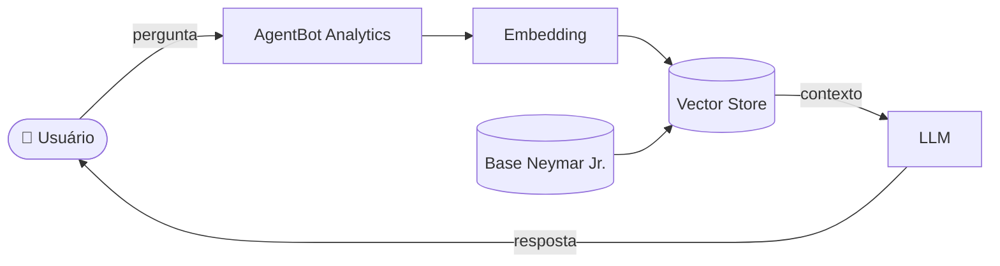

# 🤖 AgentBot Analytics — Consultor Inteligente de Carreira

> Agente de IA Generativa especializado na trajetória profissional de **Neymar Jr.**, capaz de responder perguntas analíticas sobre clubes, estatísticas, títulos e transferências com base em dados estruturados e pipeline RAG.

---

## Contexto

Agentes de IA Generativa estão redefinindo como interagimos com dados esportivos. O **AgentBot Analytics** vai além de um simples chatbot: ele atua como um **consultor especialista**, combinando recuperação semântica de informações com geração de linguagem natural para entregar respostas precisas, contextualizadas e confiáveis sobre a carreira do Neymar Jr.

---

## Arquitetura da Solução



---

## Base de Conhecimento

Os dados que alimentam o agente foram estruturados para cobrir toda a trajetória profissional do atleta:

| Arquivo | Formato | Descrição |
|---|---|---|
| `Carreira e Lesões.json` | JSON |  Gols, assistências e jogos por temporada e competição|
| `Prêmio e Títulos.json` | JSON | Conquistas por clube e seleção com datas |
| `historico.csv` | CSV | Histórico em Copas do Mundo, Copa América e Olimpíadas |
| `transacoes.cv` | JSON | Clubes, temporadas, contratos e transferências |

---

## Estrutura do Repositório

```
📁 Desafio-GenIA-Dados-dio/
│
├── 📄 README.md
│
├── 📁 data/                      # Base de conhecimento do agente
│   ├── Carreira e Lesões.json
│   ├── Premio e Títulos.json
│   ├── historico.csv
│   └── transacoes.json
│
├── 📁 docs/                          # Documentação do projeto
│   ├── 01-documentacao-agente.md     # Caso de uso e arquitetura
│   ├── 02-base-conhecimento.md       # Estratégia de dados
│   ├── 03-prompts.md                 # Engenharia de prompts
│   ├── 04-metricas.md                # Avaliação e métricas
│   └── 05-pitch.md                   # Roteiro do pitch
│
├── 📁 src/                        # Código-fonte
│   ├── app.py                     # Lógica principal do AgentBot
│
└── 📁 assets/                    # Diagramas e imagens
│
└──📁 examples/                      # Referências e exemplos
    └── README.md

```

---

## Ferramentas Utilizadas

| Categoria | Ferramenta |
|---|---|
| **LLMs** | [ChatGPT](https://chat.openai.com/), [Copilot](https://copilot.microsoft.com/), [Gemini](https://gemini.google.com/), [Claude](https://claude.ai/), [Ollama](https://ollama.ai/) |
| **Desenvolvimento** | [Streamlit](https://streamlit.io/), [Gradio](https://www.gradio.app/), [Google Colab](https://colab.research.google.com/) |
| **Processamento de Dados** | Pandas |
| **Ambiente** | Google Colab / Jupyter Notebook |

---

## Como Executar

```bash
# Instalar dependências
pip install -r requirements.txt

# Rodar a aplicação
streamlit run app.py
```

---

## Exemplos de Consultas

```
"Quantos gols o Neymar marcou pelo Santos na sua carreira?"
"Quais títulos ele conquistou no Barcelona?"
"Qual foi o valor e o contexto da transferência para o PSG?"
"Como foi o desempenho dele na Copa do Mundo de 2014?"
"Compare as estatísticas do Neymar no Brasil e na Europa."
```

---

## Desafio DIO

Projeto desenvolvido para o desafio **Gen IA & Dados**, com foco em:

- Construção de pipelines RAG aplicados a dados reais
- Engenharia de prompts para agentes especializados
- Integração entre LLMs e bases de conhecimento estruturadas

---

## Autor

**Rodrigo** — [r9drig-tech](https://github.com/r9drig-tech) / [Linkedin](https://www.linkedin.com/in/r9drig-power-bi/)
Analista de Power BI | Especialista em BI & Dashboards | Em transição para Engenharia de Dados & IA.
