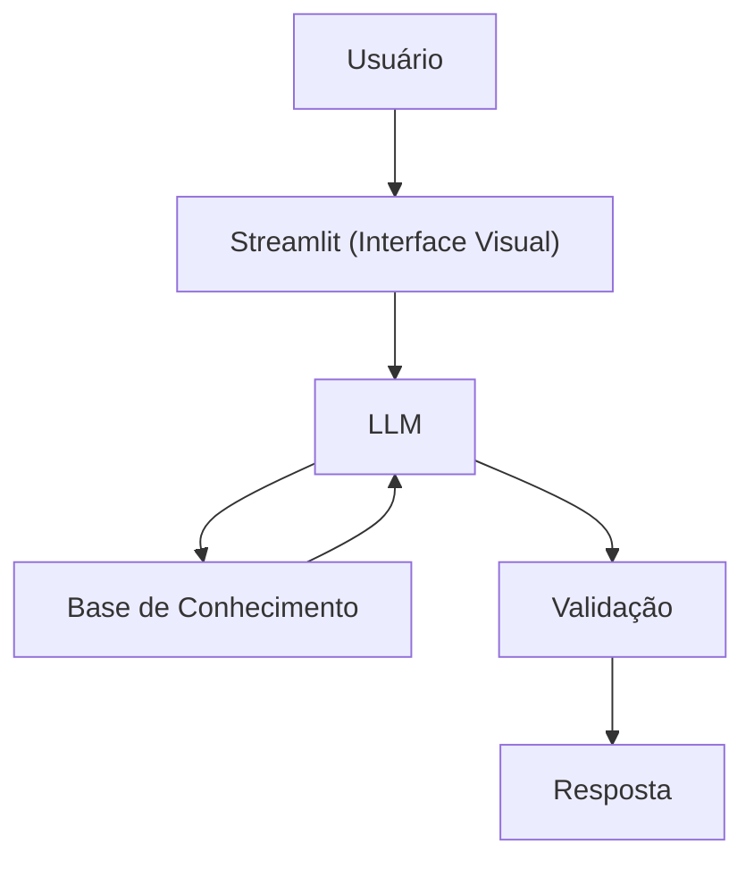

# Documentação do Agente: AgentBot Analytics

## Caso de Uso

### Problema
> Qual problema de informação seu agente resolve?
A dispersão de dados estatísticos e o excesso de informações contraditórias sobre a carreira de Neymar Jr.
É difícil encontrar em um só lugar o histórico de gols, lesões e títulos consolidados sem o risco de "alucinações" de dados.

### Solução
> Como o agente resolve esse conhecimento?
O NeyBot utiliza um LLM integrado a uma base de conhecimento estruturada e imutável.
Ele interpreta as perguntas do usuário e consulta o dicionário de carreira para fornecer dados validados e cálculos precisos de eficiência.

### Público-Alvo
> Quem vai usar esse agente?
Jornalistas Esportivos,
Analistas de desempenho e entusiastas de dados que buscam precisão técnica.

---

## Persona e Tom de Voz

### Nome do Agente
AgentBot Analytics (Agente Analitico)

### Personalidade
> Como o agente se comporta? (ex: consultivo, direto, educativo)
- Analítico
- Direto
- Comporta-se como um assistente técnico de alto nível que valoriza a precisão numérica acima de opiniões.

### Tom de Comunicação
> Formal, informal, técnico, acessível?
Técnico, Estratégico e Data-Drive.

### Exemplos de Linguagem
- Saudação: AgentBot Analytics ativado. Qual métrica da carreira de Neymar Jr. deseja consultar hoje?
- Confirmação: Entendido. Processando dados da base de conhecimento para gerar o dashboard"
- Erro/Limitação: Essa informação não consta na minha base de dados oficial. No momento, possuo dados técnicos de 2009 até Atual

---

## Arquitetura

### Diagrama

### Componentes

| Componente | Descrição |
|------------|-----------|
| Interface | [ Streamlit](https://streamlit.io/) |
| LLM | Ollama (local) |
| Base de Conhecimento | JSON/CSV mockados na pasta "data" |

---

## Segurança e Anti-Alucinação

### Estratégias Adotadas

- [X] O agente responde estritamente com base nos dados contidos no dicionário de carreira.
- [X] Os cálculos de média de gols e assistências são feitos em tempo real para evitar erros manuais.
- [X] Quando uma informação não é encontrada, o agente admite a limitação em vez de chutar valores.
- [X] Separação clara entre gols em clubes e gols em seleções (critério FIFA)

### Limitações Declaradas
> O que o agente NÃO faz?
- O agente não acessa a internet para buscar notícias em tempo real.
- Não faz previsões sobre o futuro da carreira (não é um agente de apostas).
- Não emite opiniões subjetivas (ex: "quem é melhor que quem").
- Limitado aos dados inseridos manualmente até a data da última atualização.
